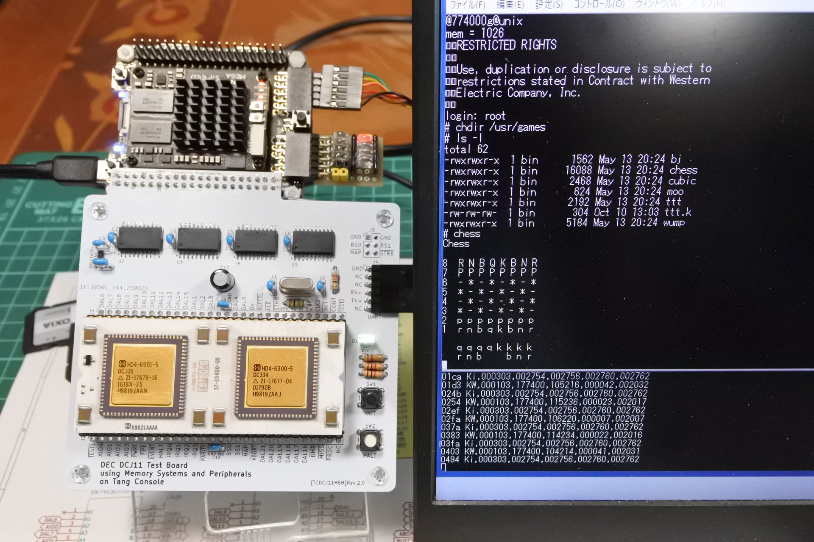

# TangConsoleDCJ11MEM
DEC DCJ11 processor test board using memory systems and peripherals implemented  on Tang Console 138K.

This document is written mostly in Japanese. If necessary, please use a translation service such as DeepL or Google.


# 概要
- PDP-11の命令セットを持つCPU「DEC DCJ11」のメモリシステムと周辺装置をFPGAボード(Tang Console 138K)上に実装する試みです．
- TangNano20Kを用いた同様のプロジェクト[TangNanoDCJ11MEM](https://github.com/ryomuk/TangNanoDCJ11MEM)の続編です．

## 主要なファイル一覧
```
.
├── diskimage : SDメモリ用データ
│   ├── Caldera-license.pdf : UNIXのライセンス条項
│   ├── sd-unix-v1.dsk      : unix v1用disk image
│   └── sd-unix-v6.dsk      : unix v6用disk image
├── fpga                     : Gowin EDA用プロジェクト
│   └── TangConsoleDCJ11MEM_project.20250902
│       └── src
│             ├── rom.v      : unix ブートローダー
│             ├── sdhd.v     : HDシミュレータモジュール
│             ├── tc138k.cst : 物理制約(ピンアサイン)
│             ├── top.v      : top module
│             └── uart.v     : uartモジュール
├── pcb
│   └── rev2.0 : 回路図，基板データ等(KiCAD 8用)
└── README.md
```
- diskimageフォルダ内にあるSDメモリ用のイメージファイルはUNIXのオリジナルソースからの派生物なので，ライセンス条件は Caldera-license.pdf (昔のBSD?)に従います．
- その他の部分についてはMITライセンスです．

## 動作状況
- UNIX first edition (UNIX V1), UNIX 6th editon (UNIX V6)が起動します．
  - unix v1
    - multi userで起動，rootでログインできました．
    - edでASCIIARTのプログラムを書いてccでセルフコンパイルして実行できました．
  - unix v6
    - multi userで起動，rootでログインできました．
    - /usr/games/ にあるchessやbj, tttなどが動きました．
    - /usr/bin/ にあるfortune, quiz, bannerなどが動きました．
    - edでASCIIARTのプログラムを書いてccでセルフコンパイルして実行できました．

# ハードウェア
## FPGAに実装した機能
- コンソール入出力用UART
- Initialization Sequence時のPower-Up Configuration Register設定
- メモリ
  - 256KB RAM (760000-777777はI/O空間とROM用なので使えるのは248KB)
  - ブート用ROM
- ハードディスクドライブ RF11, RK11 (sdメモリによるエミュレーション)
- 外部演算装置 KE11-A (unix v1に必須)
- クロック KW11-L
- BS0, BS1は見ていません．DAL[15:0]とAIO[3:0]を見ればとりあえず十分だったので．
- DAL[21:18]も見ていません．

## 基板 rev.2.0
- TangNano20K版とは違い，レベル変換ICをCPUボードに搭載してみました．
- CPUの入力信号(FPGA→CPU)はレベル変換せずに直接接続しています．
- ABORT_nはオープンコレクタなので下記のように実装しています．
```
  assign ABORT_n = bus_error ? 1'b0 : 1'bz; // simulate open collector output
```

#### BOM
|Reference          |Qty| Value          |Size |Memo |
|-------------------|---|----------------|-----|-----|
|C1,C2              |2  |68pF            |||
|C3,C5,C6,C7,C8     |5  |0.1uF           |||
|C4                 |1  |1uF           |||
|C9,C10             |2	|0.33uF	         ||DECのプロセッサボードで0.33uFを使っていたので．0.1uFでもOK．|
|C11                |1  |47uF            |||
|D1                 |1  |LED             || |
|J1                 |1  |pin socket|2x20|TangConsole接続用．基板背面に実装．|
|J2,J3              |2  |pin header or socket|1x30|任意．テストや観測，実験用．|J4                 |1  |pin header      |1x06 L字|UART用|
|J5                 |1  |pin header or socket |2x03 |不要．拡張用．|
|R1                 |1  |1M              |||
|R2,R3,R4,R5,R6,R7,R8,R9,R10   |9  |10k            || |
|R11                |1  |33             ||CLK2(出力)のダンピング抵抗|
|R12                |1  |100k            || 値はLEDに合わせて任意．最近のLEDは明るいので100kぐらいでちょうどいい．|
|R13,R14            |2  |1k              |||
|SW1,SW2            |2  |tactile SW      |6mmxH4.3mm|例: https://akizukidenshi.com/catalog/g/g103647/ |
|U1                 |1  |DCJ11           |60pin DIP 1300mil| 1x30 の丸ピンソケット2列|
|U2,U3,U4,U5        |4  |SN74CB3T3245DWR (又はDW) |SOIC-20|https://mou.sr/3URN55f https://www.digikey.jp/short/9485r0f0  |
|U6                 |1  |NJM12888F33     |SOT-23-5 | https://akizukidenshi.com/catalog/g/g110675/|
|Y1                 |1  |18MHz           |HC49|例: https://mou.sr/3WcWExh , もしかしたら周波数を変える必要があるかもしれないのでソケットを使用|

- SN74CB3T3245はパッケージサイズに注意．SOIC-20はDWかDWRです．PWやPWRではありません．

# 使い方
## ターミナルソフト(TeraTerm, PDP11GUI)との接続
- TTY入出力はTangConsoleのUSB(JTAGと共用)とCPU基板のUARTの2箇所に同じものが出ています．当初USBが不安定だったのでそのようにしたのですが，今はわりと安定してきたのでUSBだけでOKです．(両方使うとTeraTermとPDP11GUIを同時に接続できます．)
- TeraTermの設定
  - 基本的には115200bps,8N1N．ただし，UNIX V6だと7bit, parity=spaceにする必要あり．
  - 改行コードは入力出力ともCR
  - 送信遅延 10ms/字, 100ms/行
- CPU基板のUARTは，TXは3.3V出力(5VTTLで受信可)，RXは5V耐性なので，USBシリアル変換ケーブルは3.3V用，5V用のどちらでもOKです．

## UNIX V1
- SDメモリにddでsd-unix-v1.dskを書き込み，TangConsoleのスロットにセットします．
- 773000gでブートローダーを起動します．
- loginプロンプトが出るのでrootでログインします．
```
@773000g
login: root
root
# who
root    tty8 Jan  1 00:03:47
# date
Fri Jan  1 00:03:50
# chdir /tmp
# cc aa.c
I
II
# ls -l
total   14
127 sxrwrw  1 root   1062 Jan  1 00:00:00 a.out
121 s-rwrw  1 root    651 Jan  1 00:00:00 aa.c
129 s-rwrw  1 root   1104 Jan  1 00:00:00 aa.o
 55 sxrwrw  1 root   1664 Jan  1 00:00:00 etma
 56 sxrwrw  1 root     26 Jan  1 00:00:00 ttmp
 57 sxrwrw  1 root    142 Jan  1 00:00:00 utmp
# ./a.out

0000001111111111111111122222223333469 67433222221111111100000000000000000000000
000000011111111111111112222222334478  77933322222111111000000000000000000000000
0000000011111111111122222233243456B     944333221111111000000000000000000000000
0000000011111111211122222334556577A     965544422211110000000000000000000000000
00000111111111122222233333447 98         E 778532111111110000000000000000000000
00001111111122222232333344457                  43222111111000000000000000000000
000001111111122333444444455                  A643322111111000000000000000000000
000001111122223346666666667B                  A 4322111110000000000000000000000
000001222222333457F A  C889                    64322111111000000000000000000000
011111222223334458B      E                     93322111111111100000000000000000
01111222333444689E                             53322111111111100000000000000000
011122334555658                               643222221111111100000000000000000
011123                                       8543322211111111100000000000000000
011122334555658                               643222221111111100000000000000000
01111222333444689E                             53322111111111100000000000000000
011111222223334458B      E                     93322111111111100000000000000000
000001222222333457F A  C889                    64322111111000000000000000000000
000001111122223346666666667B                  A 4322111110000000000000000000000
000001111111122333444444455                  A643322111111000000000000000000000
00001111111122222232333344457                  43222111111000000000000000000000
00000111111111122222233333447 98         E 778532111111110000000000000000000000
0000000011111111211122222334556577A     965544422211110000000000000000000000000
0000000011111111111122222233243456B     944333221111111000000000000000000000000
000000011111111111111112222222334478  77933322222111111000000000000000000000000
0000001111111111111111122222223333469 67433222221111111100000000000000000000000
#
```

## UNIX V6
- SDメモリにddでsd-unix-v6.dskを書き込み，TangConsoleのスロットにセットします．
- 774000gでブートローダーを起動するとすぐにプロンプト'@'が出るので，'unix'と入力します．
- loginプロンプトが出るのでrootでログインします．
```
@774000g@unix
mem = 1026
RESTRICTED RIGHTS

Use, duplication or disclosure is subject to
restrictions stated in Contract with Western
Electric Company, Inc.

login: root
# who
root    tty8 Oct 10 14:28
# date
Fri Oct 10 14:28:42 EDT 1975
# ls -l
total 247
drwxrwxr-x  2 bin      1104 May 14 00:47 bin
drwxrwxr-x  2 bin      1824 Oct 10 12:33 dev
drwxrwxr-x  2 bin       496 Oct 10 14:28 etc
-rwxrwxrwx  1 root    29074 Oct 10 12:28 hpunix
drwxrwxr-x  2 bin       464 Oct 10 13:28 lib
drwxrwxr-x  2 bin        32 May 13 20:01 mnt
-rwxrwxrwx  1 root    28836 Oct 10 12:22 rkunix
-rwxrwxrwx  1 root    29020 Oct 10 12:25 rpunix
drwxrwxrwx  2 bin       272 Oct 10 14:19 tmp
-rwxrwxrwx  1 root    30346 Oct 10 12:32 unix
drwxrwxr-x 15 bin       240 Oct 10 12:35 usr
#
```

# 補足情報
## SDメモリ用イメージの作り方
- TangNano20Kのときと全く同じです．[unix-v1 SDメモリの準備](https://github.com/ryomuk/TangNanoDCJ11MEM/tree/main/applications/unix-v1)，
[unix-v6 sd用イメージ作成手順](https://github.com/ryomuk/TangNanoDCJ11MEM/tree/main/applications/unix-v6) を参照して下さい．

## Gowin EDA関連の注意点
- Configurationのdual-purpose pinで，SSPI, READY, DONE, CPUをチェックします．
- UARTのポートが複数あるので，Gowin programmerでは適切なポートを選択する必要があります．

## デバッグ用端子
- pmod1[1]にデバッグ用のログ(ディスクアクセスや割り込み等)を出力しています．
- pmod0[7:0]にデバッグ用のLEDを接続するようになっています．
- 基板の右上にあるBS[1:0], MAP_n, STRB_nは将来もしかしたら使うかもと思って用意している信号です．3.3Vに変換済みです．

## 開発環境
- Windows 11
  - KiCAD 8.0.5
  - GOWIN FPGA Designer V1.9.11.02(64-bit)
  - VMware Workstation 17 Player
    - Ubuntu 22.04.4
      - simh
  - TeraTerm
  - PDP11GUI

# 関連情報
・ 関連情報，先行事例等については [TangNanoDCJ11MEM](https://github.com/ryomuk/TangNanoDCJ11MEM) の末尾にまとめてあります．

# 動画
- [UNIX V6 on DEC DCJ-11 (PDP-11) with Tang Console 138K](https://www.youtube.com/watch?v=6rK0t8tJp9Y)

# 更新履歴
- 2025/09/03: 初版公開
- 2025/09/06: unix v6でもccが動いたのでREADME修正．
