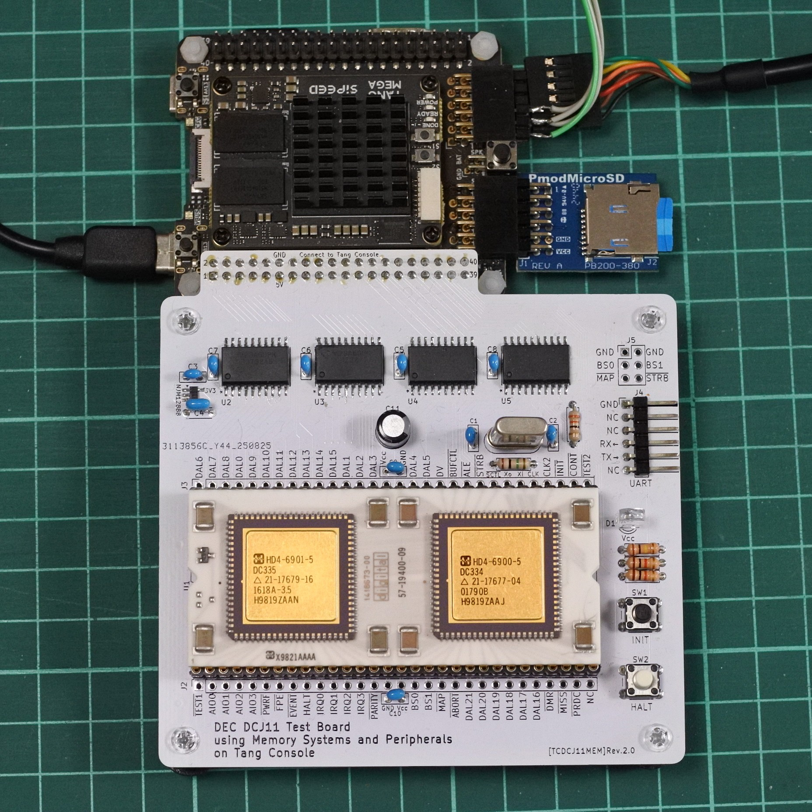

# TangConsoleDCJ11MEM
DEC DCJ11 processor test board using memory systems and peripherals implemented  on Tang Console 138K.

This document is written mostly in Japanese. If necessary, please use a translation service such as DeepL or Google.

# 概要
- PDP-11の命令セットを持つCPU「DEC DCJ11」のメモリシステムと周辺装置をFPGAボード(Tang Console 138K)上に実装する試みです．
- TangNano20Kを用いた同様のプロジェクト[TangNanoDCJ11MEM](https://github.com/ryomuk/TangNanoDCJ11MEM)の続編です．
- UNIX first edition (UNIX V1), UNIX 6th editon (UNIX V6)が起動しますが，挙動がおかしい部分もあります．(特にv6)

# ここにある主なファイル
```
.
├── diskimage                 : SDメモリ用データ
│   ├── Caldera-license.pdf  : UNIXのライセンス条項
│   ├── sd-unix-v1.dsk       : unix v1用disk image
│   └── sd-unix-v6.dsk       : unix v6用disk image
├── fpga                      : Tang Console用プロジェクト
│   └── TangConsoleDCJ11MEM_project.20250902
│       └── src
│             ├── rom.v      : unix ブートローダー
│             ├── sdhd.v     : HDシミュレータモジュール
│             ├── tc138k.cst : 物理制約(ピンアサイン)
│             ├── top.v      : top module
│             └── uart.v     : uartモジュール
├── pcb
│   └── rev2.0 : 回路図，基板データ等(KiCAD 8)
└── README.md
```
- diskimageフォルダ内にあるSDメモリ用のイメージファイルはUNIXのオリジナルソースからの派生物なので，ライセンス条件は Caldera-license.pdf に従います．

# ハードウェア

## FPGAに実装した機能
- コンソール入出力用UART
- Initialization Sequence時のPower-Up Configuration Register設定
- メモリ
  - 256KB RAM (760000-777777はI/O空間とROM用なので使えるのは248KB)
  - ブート用ROM
- ハードディスクドライブ RF11, RK11 (sdメモリによるエミュレーション)
- 外部演算装置 KE11-A (unix v1に必須)
- クロック KW11-L
- BS0, BS1は見ていません．DAL[15:0]とAIO[3:0]を見ればとりあえず十分だったので．
- DAL[21:18]も見ていません．

## 基板 rev.2.0

#### BOM
|Reference          |Qty| Value          |Size |Memo |
|-------------------|---|----------------|-----|-----|
|C1,C2              |2  |68pF            |||
|C3,C5～C8     |5  |0.1uF           |||
|C4                 |1  |1uF           |||
|C9,C10             |2	|0.33uF	         ||DECのプロセッサボードで0.33uFを使っていたので．0.1uFでもOK．|
|C11                |1  |47uF            |||
|D1                 |1  |LED             || |
|J1                 |1  |pin socket|2x20|TangConsole接続用．基板背面に実装．|
|J2,J3              |2  |pin header or socket|1x30|任意．テストや観測，実験用．|J4                 |1  |pin header      |1x06 L字|UART用|
|J5                 |1  |pin header or socket |2x03 |不要．拡張用．|
|R1                 |1  |1M              |||
|R2～R10            |9  |10k            || |
|R11                |1  |33             ||CLK2(出力)のダンピング抵抗|
|R12                |1  |100k            || 値はLEDに合わせて任意．最近のLEDは明るいので100kぐらいでちょうどいい．|
|R13,R14            |2  |1k              |||
|SW1,SW2            |2  |tactile SW      |6mmxH4.3mm|例: https://akizukidenshi.com/catalog/g/g103647/ |
|U1                 |1  |DCJ11           |60pin DIP 1300mil| 1x30 の丸ピンソケット2列|
|U2～U5             |4  |SN74CB3T3245DWR (又はDW) |SOIC-20|https://mou.sr/3URN55f https://www.digikey.jp/short/9485r0f0  |
|U6                 |1  |NJM12888F33     |SOT-23-5 | https://akizukidenshi.com/catalog/g/g110675/|
|Y1                 |1  |18MHz           |HC49|例: https://mou.sr/3WcWExh , もしかしたら周波数を変える必要があるかもしれないのでソケットを使用|

- SN74CB3T3245はパッケージサイズに注意．SOIC-20はDWかDWRです．PWやPWRではありません．

# 使い方
## ターミナルソフトとの接続
- シリアルの設定は基本的には115200bps,8N1Nにしています．(UNIX V6だとTeraTermで7N1Nにしないと文字化けする現象あり．)
- TTY入出力はTangConsoleのUSB(JTAGと共用)ですが，最初の頃にわりと不安定だったので，CPUボード上にもUART(GPIO_UART)を用意してミラーリングしています．TeraTermとPDP11GUIを同時に接続できます．
- これらとは別に，pmod1[0]にデバッグ用のディスクアクセスログを出力しています．


# [応用例(applications/)](applications/)
## [UNIX V1(applications/unix-v1)](applications/unix-v1/)
- SDメモリを使ったdiskエミュレータを作成し，UNIX V1を動かしてみました．
- 最初はかなり不安定でしたが，だいぶ安定して動くようになってきました．

## [UNIX V6(applications/unix-v6)](applications/unix-v6/)(実験用)
- unix-v1用をベースにUNIX V6に必要な機能を逐次追加中です．修正のたびにV1の動作確認をするのは面倒なのでV1用と分けることにしました．

# 開発環境
- Windows 11
  - KiCAD 8.0.5
  - GOWIN FPGA Designer V1.9.11.02(64-bit)
  - VMware Workstation 17 Player
    - Ubuntu 22.04.4
      - simh
  - TeraTerm
  - PDP11GUI

## メモ
- FPGAのプロジェクトを
- dual purpose pin
  - integer_division
  

# 動画
- [PDP-11 Paper-Tape BASIC running on DCJ-11 Processor](https://www.youtube.com/watch?v=F_eFMz5ysK8)

- [UNIX V1 on DEC DCJ-11 with TangNano 20K (under development)](https://www.youtube.com/watch?v=DT7xJWeF46Y)

- [UNIX V1 on DEC DCJ-11 with TangNano 20K](https://www.youtube.com/watch?v=G9AFgAaTexo)

# 関連情報
## データシート等
### bitsavers
- [DCJ11 Microprocessor User's Guide](http://www.bitsavers.org/pdf/dec/pdp11/1173/EK-DCJ11-UG-PRE_J11ug_Oct83.pdf), DEC, EK-DCJ11-UG-PRE(Preliminary)
- [Index of /pdf/dec/pdp11/j11](http://bitsavers.trailing-edge.com/pdf/dec/pdp11/j11/)
- [Index of /pdf/dec/pdp11/1173](http://bitsavers.trailing-edge.com/pdf/dec/pdp11/1173/)

## 先行事例，先駆者たち
- [PDP-11/HACK](http://madrona.ca/e/pdp11hack/index.html), Brent Hilpert
- [My PDP-11 Projects](https://www.5volts.ch/pages/pdp11hack/), Peter Schranz
- [PDP11 on a breadboard A.K.A. J11 Hack](https://www.chronworks.com/J11/), Len Bayles
- [S100 Bus PDP-11 CPU Board](http://www.s100computers.com/My%20System%20Pages/PDP11%20Board/PDP11%20Board.htm), John Monahan

## 開発環境関連
- [PDP-11(エミュ）上でCで"Hello, World!"](https://qiita.com/hifistar/items/8eff4a73087f3a41e19f), hifistar
- [PDP-11のgccクロスコンパイル環境の構築メモ](https://qiita.com/hifistar/items/187fd7ad780c6aa26141), hifistar
- [SimH (History Simulator)](http://simh.trailing-edge.com/)
- [j-hoppe/PDP11GUI](https://github.com/j-hoppe/PDP11GUI)

## UNIX関連
- [The Unix Heritage Society](https://www.tuhs.org/)
- [V1](https://www.tuhs.org/cgi-bin/utree.pl?file=V1)
- [UNIX First Edition](https://gunkies.org/wiki/UNIX_First_Edition)
- [jserv/unix-v1](https://github.com/jserv/unix-v1)

## 関連記事

# 更新履歴
- 2025/09/03: 初版公開
