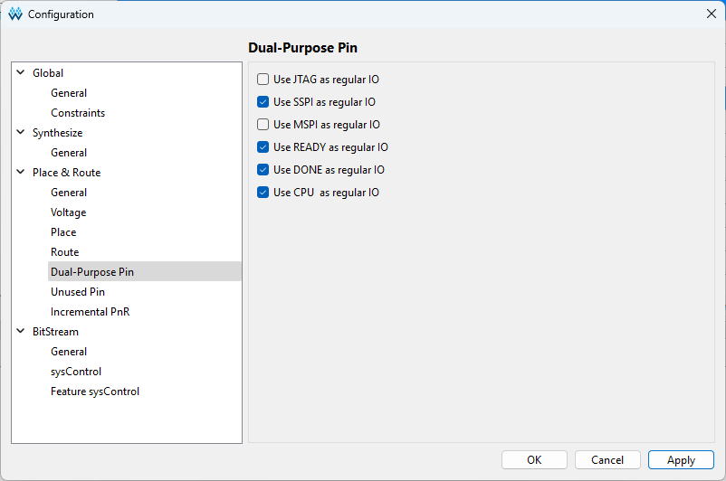

# ビルド時の注意点
## config
- Configurationのdual-purpose pinで，SSPI, READY, DONE, CPUをチェックします．

## program
- UARTのポートが複数あるので，Gowin programmerでは適切なポートを選択する必要があります．

- SRAMではなくflashメモリに書き込みます．数分かかります．

## reconfigボタン
- Tang Consoleになって付いたreocnfigボタンがかなり便利です．FPGAをreconfigして初期化してくれます．Tang Nano 20Kのときには付いていなかった(それ用のパッドはある)ので毎回書き込み直していました．

# FPGAに実装した機能
- コンソール入出力用UART
- Initialization Sequence時のPower-Up Configuration Register設定
- メモリ
  - 256KB RAM (760000-777777はI/O空間とROM用なので使えるのは248KB)
  - ブート用ROM
- ハードディスクドライブ RF11, RK11 (sdメモリによるエミュレーション)
- 外部演算装置 KE11-A (unix v1に必須)
- 紙テープリーダパンチャ PC11
- クロック KW11-L
- BS0, BS1は見ていません．DAL[15:0]とAIO[3:0]を見ればとりあえず十分だったので．
- DAL[21:18]も見ていません．
- 磁気テープドライブ TM11 (TU10)
- 大容量ハードディスクドライブRP11 (RP03)
